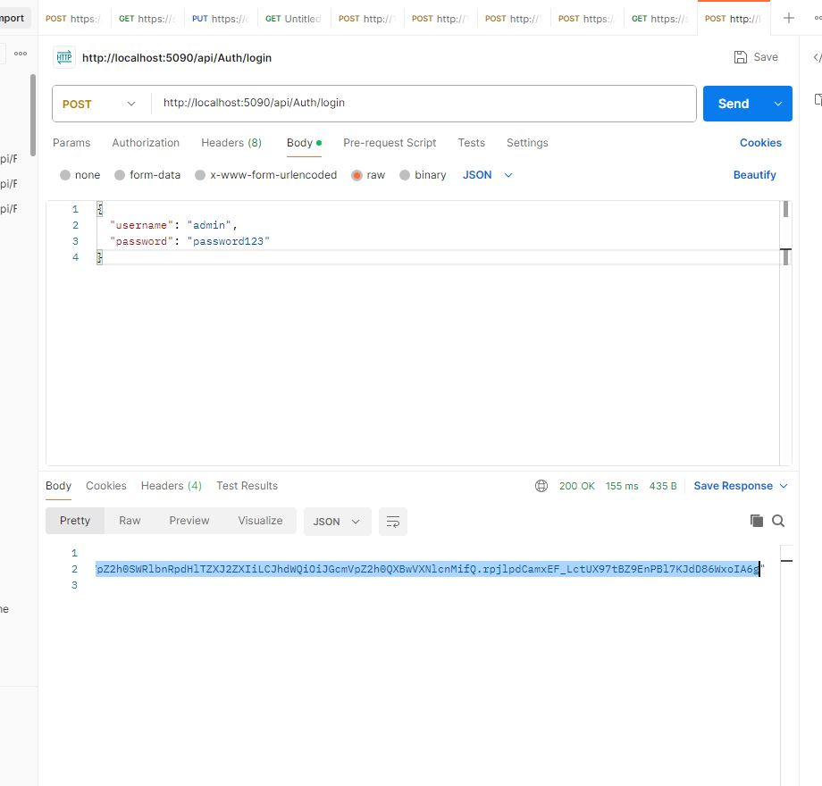
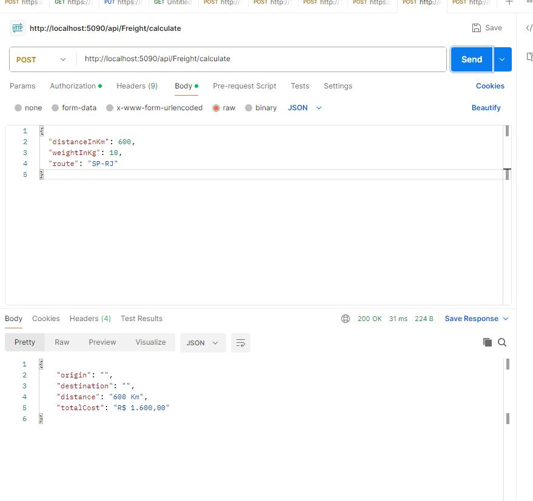
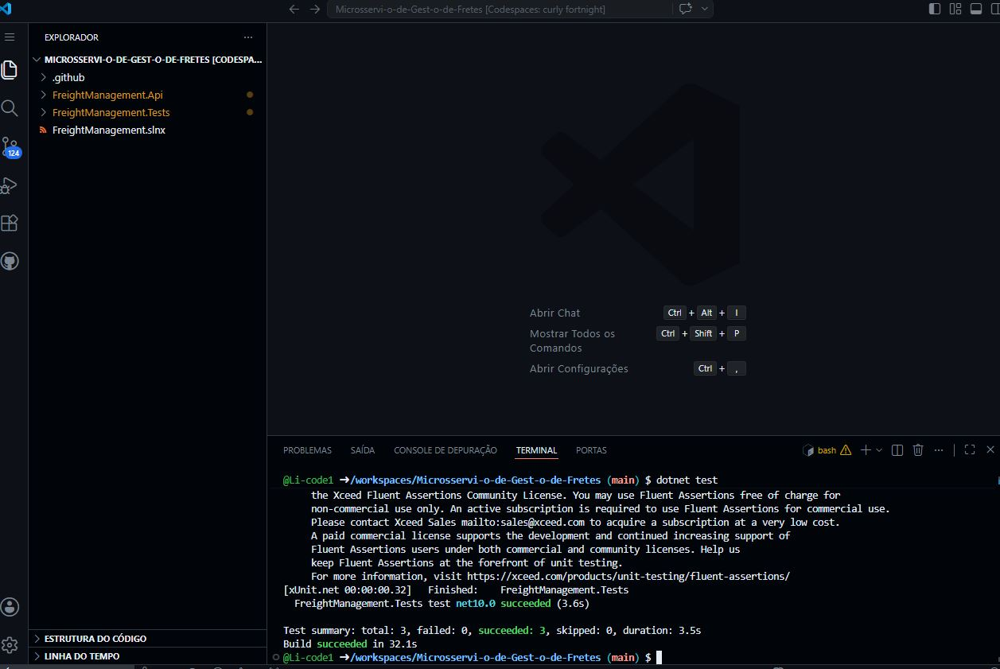

# Microsserviço de Gestão de Fretes 🚚


Este é um microsserviço de produção moderno desenvolvido em **.NET 10** focado no cálculo e gerenciamento de rotas de entrega. O projeto destaca conceitos fundamentais de nuvem, segurança robusta, testabilidade automatizada e documentação interativa.

---

## 🌟 Conceitos e Diferenciais Destacados

- **Autenticação & Autorização:** Proteção de endpoints utilizando **JWT (JSON Web Tokens)** para simular arquiteturas reais de nuvem e Identity APIs.
- **Testes Automatizados:** Cobertura de regras de negócio complexas utilizando **xUnit** para a estrutura de testes e **FluentAssertions** para escritas legíveis e fluidas.
- **Princípios de Arquitetura Limpa:** Total isolamento entre regras de domínio (cálculo de quilometragem e taxas) e a camada de exposição de API.
- **Documentação Interativa:** Integração nativa com **Swagger** para fornecer uma interface clara de experimentação dos endpoints.

---

## ⚙️ Regras de Negócio e Endpoints

1. **`POST /api/Auth/login`**: Endpoint público de autenticação. Use as credenciais para obter o Token JWT válido:
   ```json
   {
     "username": "admin",
     "password": "password123"
   }

2- POST /api/Freight/calculate: Endpoint protegido (requer Token Bearer no Header).

Preço Base: R$ 2,50 por Km rodado.

Taxa de Longa Distância: Acréscimo fixo de R$ 100,00 para rotas acima de 500 Km de distância total.

## 🚀 Como Testar a API Localmente (Postman)

Siga os passos abaixo para validar os fluxos de autenticação e cálculo de frete diretamente no seu Postman local.

### 1. Inicializar a API
No terminal da raiz do projeto, execute os comandos abaixo para garantir uma inicialização limpa:
```bash
dotnet clean
dotnet run --project FreightManagement.Api/FreightManagement.Api.csproj

```

A API estará escutando no endereço local: `http://localhost:5090`.

---

### 2. Fluxo de Autenticação (Gerar Token JWT)

Como os endpoints de negócio são protegidos, o primeiro passo é realizar o login para obter um token de acesso válido.

* **Método:** `POST`
* **URL:** `http://localhost:5090/api/Auth/login`
* **Headers:** `Content-Type: application/json`
* **Body (raw - JSON):**

```json
{
  "username": "admin",
  "password": "sua_senha_aqui"
}

```

> 📥 **Ação:** Copie o código do token retornado no campo `"token"` da resposta.

---

### 3. Fluxo de Cálculo de Frete (Endpoint Protegido)

Com o token em mãos, você já pode realizar requisições para processar as taxas de entrega.

* **Método:** `POST`
* **URL:** `http://localhost:5090/api/Freight/calculate`
* **Headers:**
* `Content-Type: application/json`


* **Authorization:**
* Selecione a aba **Auth** no Postman, escolha o tipo **Bearer Token** e cole o token copiado no passo anterior.


* **Body (raw - JSON):**

```json
{
  "distanceInKm": 150.5,
  "weightInKg": 22.4,
  "route": "São Paulo - Praia Grande"
}

```

## 🧪 Demonstração dos Testes (Postman)

Para validar a segurança da API e as regras de negócio, os testes foram realizados localmente. Clique nos títulos abaixo para visualizar as evidências:

<details>
  <summary>🔑 Clique para ver o teste de Autenticação (JWT)</summary>
  <br>
  <p>Envio das credenciais para o endpoint <code>/api/Auth/login</code> para receber o token de acesso seguro.</p>
  
</details>

<details>
  <summary>🚚 Clique para ver o teste de Cálculo de Frete (Status 200 OK)</summary>
  <br>
  <p>Envio dos dados de distância, peso e rota para o endpoint <code>/api/Freight/calculate</code> com o token ativo.</p>
  
</details>

<details>
  <summary>🚚 Clique para ver os resultados dos testes</summary>
  <br>
  
</details>
